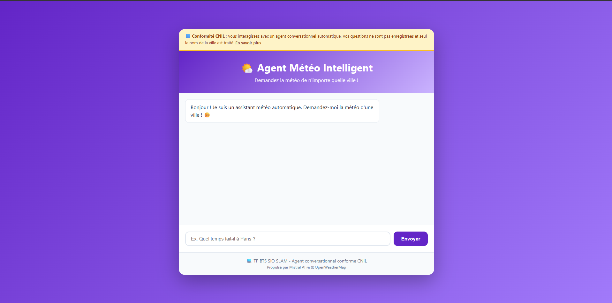

# 🌤️ Agent Conversationnel Météo - TP BTS SIO SLAM

Agent conversationnel intelligent qui fournit des informations météorologiques en utilisant Mistral AI et l'API OpenWeatherMap, conforme aux recommandations CNIL.

## 🚀 Démarrage rapide (5 minutes)

### 1. Prérequis
- Python 3.8 ou supérieur
- Compte gratuit Mistral AI : https://console.mistral.ai/
- Compte gratuit OpenWeatherMap : https://openweathermap.org/api

### 2. Installation

```bash
# Cloner ou télécharger ce projet

# Créer un environnement virtuel
python -m venv venv

# Activer l'environnement virtuel
# Sur Windows :
venv\Scripts\activate
# Sur Mac/Linux :
source venv/bin/activate

# Installer les dépendances
pip install -r requirements.txt
```

### 3. Configuration des clés API

```bash
# Copier le fichier exemple
cp .env.example .env

# Éditer le fichier .env et ajouter vos clés API
# MISTRAL_API_KEY=votre_cle_mistral
# OPENWEATHER_API_KEY=votre_cle_openweather
```

#### Obtenir les clés API :

**Mistral AI** (5€ gratuits à l'inscription) :
1. Créer un compte sur https://console.mistral.ai/
2. Aller dans "API Keys"
3. Créer une nouvelle clé et la copier

**OpenWeatherMap** (1000 appels/jour gratuits) :
1. Créer un compte sur https://openweathermap.org/
2. Aller dans "API Keys"
3. Copier la clé par défaut

### 4. Lancer l'application

```bash
# Démarrer le serveur Flask
python app.py
```

Ouvrir votre navigateur : http://localhost:5000

## 📁 Structure du projet

```
tp_meteo_mistral/
├── .env                    # Clés API (à créer à partir de .env.example)
├── .env.example            # Modèle de configuration
├── .gitignore             # Fichiers à ignorer (inclut .env)
├── requirements.txt       # Dépendances Python
├── README.md              # Ce fichier
├── agent_meteo.py         # Logique de l'agent conversationnel
├── app.py                 # Application Flask
├── templates/
│   └── index.html         # Interface web
└── static/
    └── style.css          # Style CSS
```

## 🎯 Fonctionnalités

- ✅ **Agent conversationnel** intelligent avec Mistral AI
- ✅ **Données météo en temps réel** via OpenWeatherMap
- ✅ **Interface web moderne** et responsive
- ✅ **Conforme CNIL** : transparence, minimisation, pas de stockage
- ✅ **Traitement du langage naturel** pour extraire les villes
- ✅ **Réponses personnalisées** et contextuelles

## 💬 Exemples d'utilisation

```
Vous : Quel temps fait-il à Paris ?
Bot : À Paris, il fait actuellement 15°C avec un ciel dégagé. 
      Parfait pour une balade ! 🌤️

Vous : Météo Lyon
Bot : À Lyon, la température est de 18°C avec quelques nuages. 
      N'oubliez pas une petite veste ! ☁️

Vous : J'aimerais savoir le temps qu'il fait à Marseille
Bot : À Marseille, il fait 22°C avec un grand soleil ! 
      Idéal pour profiter de la plage ! ☀️
```

## 🛡️ Conformité CNIL

Cette application respecte les recommandations de la CNIL pour les agents conversationnels :

- **Transparence** : L'utilisateur est informé qu'il interagit avec un robot
- **Minimisation** : Seul le nom de la ville est collecté
- **Pas de stockage** : Aucune conversation n'est enregistrée
- **Sécurité** : Les clés API sont stockées dans .env (non versionné)
- **Information** : Une bannière explique le fonctionnement

## 🔧 Test du code

```bash
# Tester l'agent conversationnel directement
python agent_meteo.py
```

## 📚 Ressources

- [Documentation CNIL - Agents conversationnels](https://www.cnil.fr/fr/intelligence-artificielle/lintelligence-artificielle-qui-parle-les-agents-conversationnels)
- [Documentation Mistral AI](https://docs.mistral.ai/)
- [Documentation OpenWeatherMap](https://openweathermap.org/api)

## ⚠️ Dépannage

**Erreur "Clés API manquantes"** :
- Vérifiez que le fichier `.env` existe (copié depuis `.env.example`)
- Vérifiez que vos clés sont correctement ajoutées dans `.env`

**Erreur "Ville non trouvée"** :
- Vérifiez l'orthographe du nom de la ville
- Essayez en anglais pour les villes internationales

**Erreur Mistral AI** :
- Vérifiez votre crédit gratuit sur console.mistral.ai
- Vérifiez que votre clé API est valide

## Documentation technique

Cette section décrit l'architecture, le flux de données, les points d'extension, la configuration et les bonnes pratiques pour développer et déployer l'agent conversationnel météo.

### Architecture générale

- **Frontend** : page web servie par Flask (`templates/index.html`) qui envoie les messages utilisateur vers l'API `/chat`.
- **Backend** : application Flask (`app.py`) exposant les endpoints, et la classe `AgentMeteo` (`agent_meteo.py`) qui orchestre :
  - l'extraction du nom de la ville via Mistral AI;
  - l'appel à l'API OpenWeatherMap pour récupérer les données météo;
  - la génération d'une réponse naturelle via Mistral AI.
- **Dépendances externes** : Mistral AI (SDK `mistralai`), OpenWeatherMap (HTTP REST), `requests`, `python-dotenv`.

### Composants principaux

- `app.py`
  - Endpoints :
    - `GET /` : page d'accueil (interface et bannière CNIL).
    - `POST /chat` : reçoit JSON `{ "message": "..." }`, renvoie JSON de la réponse du bot.
    - `GET /stats` : compteur anonyme d'utilisation (`total_requetes`).
  - Vérifie la présence des clés API au démarrage et lance le serveur Flask.

- `agent_meteo.py`
  - Classe `AgentMeteo` exposant `traiter_message(message)`.
  - Méthodes clefs :
    - `extraire_ville(message)` : interroge Mistral pour extraire la ville (format attendu JSON).
    - `obtenir_meteo(ville)` : appelle OpenWeatherMap et normalise les champs retournés.
    - `generer_reponse(meteo_data)` : demande à Mistral une formulation naturelle.

### Flux de données (simplifié)

1. L'utilisateur saisit un message dans l'UI et l'envoie.
2. Le frontend POST `/chat` avec `{ "message": "..." }`.
3. `AgentMeteo.traiter_message` appelle `extraire_ville` (Mistral).
4. Si une ville est extraite : `obtenir_meteo` (OpenWeatherMap).
5. Si les données météo sont valides : `generer_reponse` (Mistral).
6. Le backend renvoie `{ success, message, data? }` au frontend.

### Endpoints et payloads

- `POST /chat`
  - Requête : `Content-Type: application/json` body `{ "message": "Quel temps à Lyon ?" }`.
  - Réponses possibles :
    - Succès :
      {
        "success": true,
        "message": "...réponse utilisateur...",
        "data": { /* données météo normalisées */ }
      }
    - Erreur / demande de précision :
      {
        "success": false,
        "message": "Précise la ville, s'il te plaît."
      }

- `GET /stats` : renvoie `{ "total_requetes": <nombre> }` (anonyme, pas d'identifiants).

### Variables d'environnement

Créez un fichier `.env` (copier `.env.example`) et ajoutez :

```
MISTRAL_API_KEY=votre_cle_mistral
OPENWEATHER_API_KEY=votre_cle_openweather
```

Ces clés sont lues via `python-dotenv` au démarrage.

### Sécurité et conformité CNIL

- Minimisation : seules les données strictement nécessaires sont traitées (nom de la ville).
- Pas de persistance : aucune conversation n'est stockée sur le serveur.
- Pas de cookies de tracking ni d'analytics intégrés.
- Les clés API sont conservées en variables d'environnement (fichier `.env` ignoré par git).
- Transparence : l'agent se présente comme un robot (voir `system_prompt` dans `AgentMeteo`).

Bonnes pratiques recommandées :
- Restreindre l'accès réseau aux services (config firewall) en production.
- Utiliser des secrets manager (Vault, AWS Secrets Manager) pour la production.

### Points d'extension et personnalisation

- Remplacer le modèle Mistral : modifier `self.model` dans `agent_meteo.py`.
- Ajouter historisation (optionnelle) : insérer une couche DB et anonymiser/agréger les logs.
- Support multi-langue : changer `lang` et adapter les prompts dans `agent_meteo.py`.
- Ajouter fallback si Mistral indisponible : implémenter un générateur de réponses local.

### Exemples d'utilisation (CLI / curl)

Envoyer une requête de test :

```bash
curl -X POST http://localhost:5000/chat \
  -H "Content-Type: application/json" \
  -d '{"message":"Quel temps fait-il à Paris ?"}'
```

Vérifier les statistiques anonymes :

```bash
curl http://localhost:5000/stats
```

### Tests locaux rapides

- Tester directement l'agent (script de test intégré) :

```bash
python agent_meteo.py
```

- Démarrer le serveur Flask :

```bash
python app.py
```

### Débogage et logs

- Les impressions (`print`) dans `app.py` et `agent_meteo.py` fournissent des messages d'erreur basiques.
- Pour une mise en production, remplacer `print` par un logger structuré (`logging`), et activer un niveau `INFO`/`ERROR`.

### Déploiement (conseils)

- Conteneurisation : créer un `Dockerfile` minimal exposant le port 5000.
- Variables d'environnement injectées via le runtime (Kubernetes secrets / Docker secrets).
- Ne pas exposer d'interface d'administration sans authentification.

---

## 📝 Licence

Ce projet est à but éducatif dans le cadre du BTS SIO SLAM.

## Aperçu Application



---

**Bon développement ! 🚀**
